<center>

# CONFIGURACIÓN DE POSTGRESQL CON DJANGO

</center>

**_Nombre:_** Antonio Navarro Hernández
**_Curso:_** 2º de Ciclo Superior de Desarrollo de Aplicaciones Web.

### ÍNDICE

- [Introducción](#id1)
- [Objetivos](#id2)
- [Material empleado](#id3)
- [Desarrollo](#id4)
- [Conclusiones](#id5)

#### **_Introducción_**. <a name="id1"></a>

Esta práctica se centra en la configuración de un entorno de desarrollo web completo utilizando Django como framework de desarrollo, PostgreSQL como sistema de gestión de base de datos, y pgAdmin como herramienta de administración de bases de datos. El objetivo principal es migrar un proyecto Django desde SQLite (base de datos por defecto) hacia PostgreSQL, que es la opción recomendada para entornos de producción debido a su mayor robustez, escalabilidad y funcionalidades avanzadas.


#### **_Objetivos_**. <a name="id2"></a>

Los objetivos principales de esta práctica son:

1. **Instalación y configuración de PostgreSQL**: Instalar el servidor de base de datos PostgreSQL en el sistema y realizar la configuración básica.

2. **Instalación de pgAdmin**: Instalar y configurar pgAdmin como herramienta de administración web para PostgreSQL.

3. **Configuración de Django para PostgreSQL**: Modificar la configuración de Django para utilizar PostgreSQL como base de datos en lugar de SQLite.

4. **Gestión de bases de datos**: Crear una nueva base de datos, un usuario con permisos adecuados y configurar las conexiones.

5. **Migración de datos**: Realizar las migraciones necesarias para crear la estructura de la base de datos en PostgreSQL.

6. **Verificación del funcionamiento**: Comprobar que la aplicación Django funciona correctamente con la nueva configuración de base de datos.

#### **_Material empleado_**. <a name="id3"></a>

**Hardware:**

- Sistema operativo Linux (Ubuntu/Debian)
- Equipo de desarrollo con conexión a internet

**Software:**

- **Sistema operativo**: Linux con interfaz de línea de comandos
- **Python**: Intérprete de Python 3.x (ya instalado en el sistema)
- **Django**: Framework web de Python (versión 6.0)
- **PostgreSQL**: Sistema de gestión de base de datos relacional
- **pgAdmin**: Herramienta de administración web para PostgreSQL
- **Gunicorn**: Servidor WSGI para Python
- **Terminal**: Para ejecutar comandos de instalación y configuración

**Configuraciones realizadas:**

- Instalación de dependencias de desarrollo (curl, apt-transport-https)
- Configuración de PostgreSQL con usuario y base de datos
- Configuración de Django para conectar con PostgreSQL
- Configuración de servicios del sistema

#### **_Desarrollo_**. <a name="id4"></a>

**Paso 1: Instalación de PHP y dependencias**

Comenzamos instalando PHP y sus dependencias necesarias para el desarrollo web. Esto incluye la configuración de repositorios APT y la instalación de paquetes adicionales.


Después de la instalación de PHP, realizamos una actualización del sistema para asegurar que todos los paquetes estén actualizados:

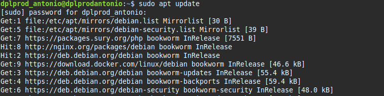


**Paso 2: Instalación de dependencias adicionales**

Instalamos curl y apt-transport-https, que son necesarios para la gestión de repositorios HTTPS y transferencia de datos:

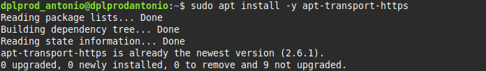


**Paso 3: Instalación de curl**

Instalamos curl como herramienta adicional para transferencias de datos:

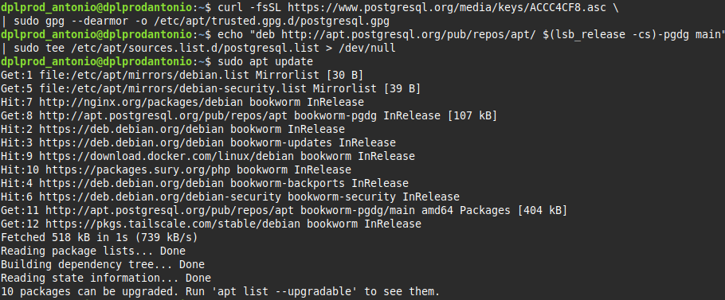


**Paso 4: Instalación de PostgreSQL**

Procedemos con la instalación de PostgreSQL, que será nuestro sistema de gestión de base de datos:

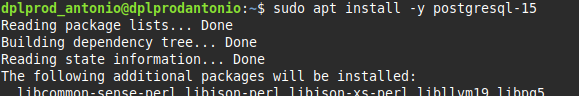


**Paso 5: Verificación de versiones**

Verificamos las versiones instaladas de los componentes principales:

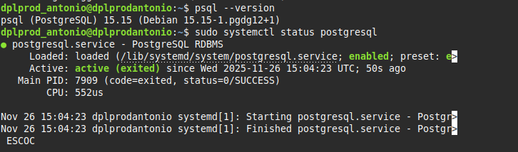


**Paso 6: Verificación de servicios de red**

Comprobamos que PostgreSQL esté escuchando en el puerto adecuado (por defecto el 5432):

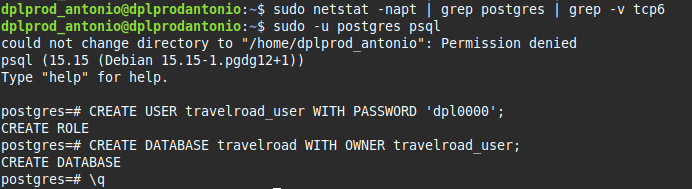


**Paso 7: Creación de base de datos**

Accedemos a PostgreSQL para crear la base de datos de nuestro proyecto:

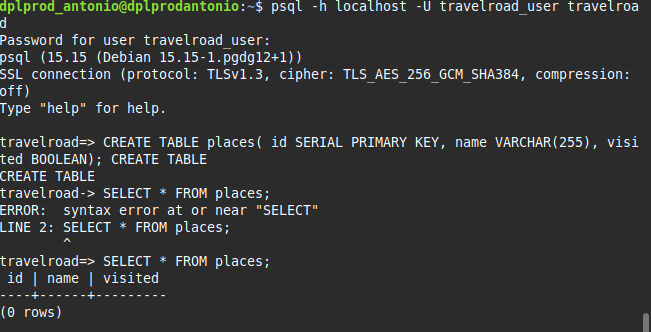


**Paso 8: Configuración de delimitadores**

Configuramos los delimitadores en PostgreSQL para procedimientos almacenados:


**Paso 9: Creación de entorno virtual Python**

Creamos un entorno virtual para nuestro proyecto Django:

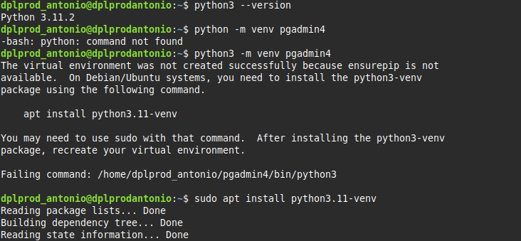


**Paso 10: Instalación de pgAdmin**

Instalamos pgAdmin como herramienta de administración web:

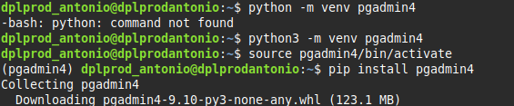


**Paso 11: Verificación de pgAdmin instalado**

Confirmamos que pgAdmin se instaló correctamente:

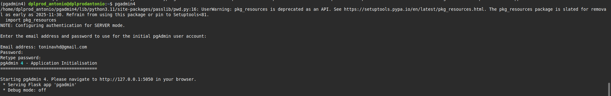


**Paso 12: Instalación de Gunicorn**

Instalamos Gunicorn como servidor WSGI para producción:

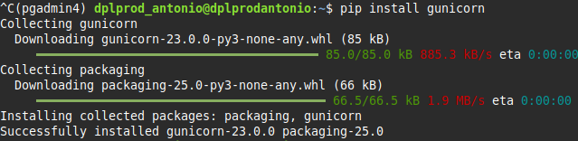


**Paso 13: Activación de servicio pgAdmin**

Configuramos y activamos el servicio de pgAdmin:

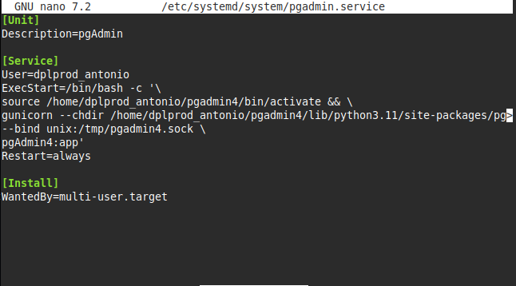


**Paso 14: Verificación del servicio activo**

Comprobamos que el servicio de pgAdmin esté funcionando correctamente:

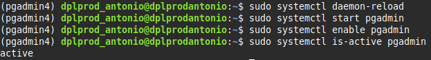


**Configuración final de Django**

El proyecto Django se configuró para utilizar PostgreSQL modificando el archivo `settings.py`:

```python
DATABASES = {
    'default': {
        'ENGINE': 'django.db.backends.postgresql',
        'NAME': 'travelroad',
        'USER': 'travelroad_user',
        'PASSWORD': 'dpl0000',
        'HOST': 'localhost',
        'PORT': 5432,
    }
}
```

Se utilizó la librería `prettyconf` para la configuración externa:

```python
from prettyconf import config

DEBUG = config('DEBUG', default=True, cast=config.boolean)
ALLOWED_HOSTS = config('ALLOWED_HOSTS', default=[], cast=config.list)

DATABASES = {
    'default': {
        'ENGINE': 'django.db.backends.postgresql',
        'NAME': config('DB_NAME', default='travelroad'),
        'USER': config('DB_USERNAME', default='travelroad_user'),
        'PASSWORD': config('DB_PASSWORD', default='dpl0000'),
        'HOST': config('DB_HOST', default='localhost'),
        'PORT': config('DB_PORT', default=5432, cast=int),
    }
}
```

#### **_Conclusiones_**. <a name="id5"></a>

La configuración de PostgreSQL con Django ha sido completada exitosamente, logrando establecer un entorno de desarrollo robusto y escalable. Los principales logros de esta práctica incluyen:

